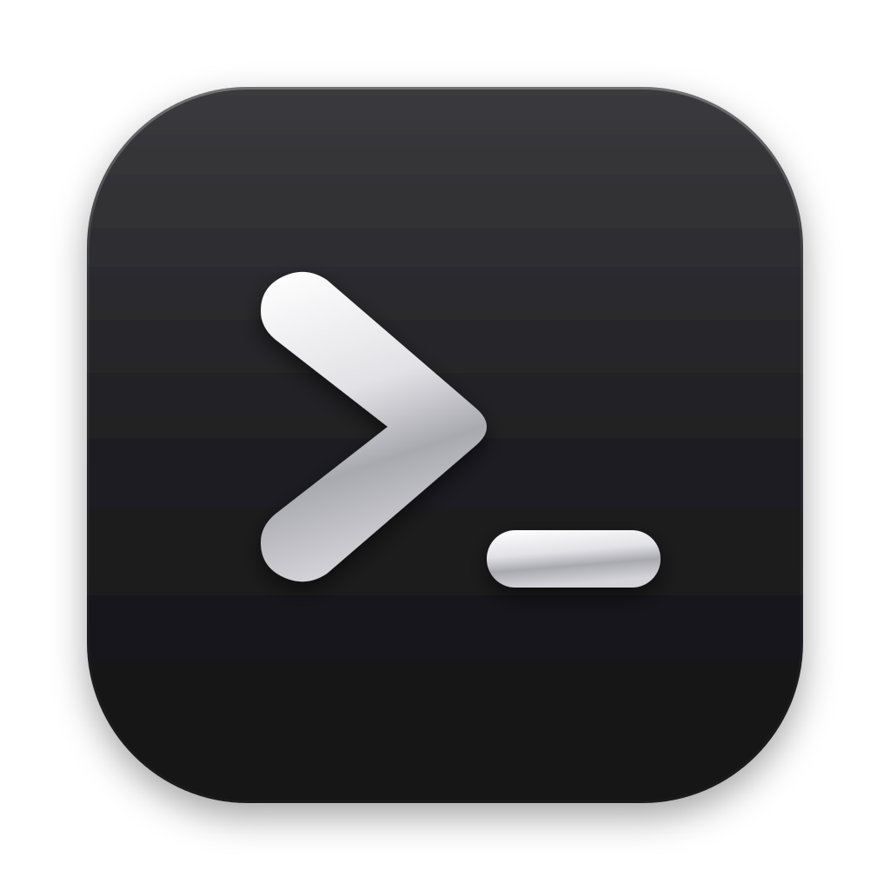

<p align="center">
  
</p>

<h1 align="center">Just Harness</h1>

<p align="center"><b>The basics are all you need.</b></p>

<p align="center">A small macOS app for the <a href="https://opencode.ai">opencode</a> and <a href="https://cline.bot">Cline</a> coding agents: projects, chats, skills, and a built-in browser they can drive. Nothing else.</p>

<p align="center"><a href="https://github.com/AtheerAPeter/just-harness/releases/latest"><b>Download for macOS (Apple Silicon)</b></a></p>

---

Just Harness has no model providers and no API keys of its own. It starts the CLIs you already have installed, talks to them over the [Agent Client Protocol](https://agentclientprotocol.com) (`opencode acp`, `cline --acp`), and shows whatever models they report. If a model works in your terminal, it works here.

## What's in it

- **Projects and chats.** Add a folder, start chats in it. Each chat runs OpenCode or Cline in that folder and resumes where it left off after a restart.
- **Model pickers from the agent itself.** Provider, model and reasoning effort come live from the agent's session, so switching Cline's provider reloads its model list.
- **A built-in browser.** A panel on the right that keeps your logins across restarts. Agents control it through the `harness_browser` tools (navigate, snapshot, click, type, keyboard shortcuts, screenshot, …) and you watch it happen. They can also attach files to upload buttons, paste images, and download files to `~/Downloads`. Each chat has its own browser page (sharing your logins), so several chats can run browser automations at once, and each chat's page is remembered across restarts. Tag a message with `@browser` to point the agent at it. Opencode's own tool for driving your desktop browser is turned off, so agents stay in the panel.
- **Skills.** Browse, create and edit `SKILL.md` skills for both agents. Type `/` in the composer to run a skill or an agent command.
- **`@` mentions.** Tag project files (respects `.gitignore`); they're attached to the prompt as file references.
- **Bypass permissions** per chat, approving tool requests automatically (allow once).
- **Project only** per chat: any tool request that touches a path outside the project folder asks you first (allow once, allow always, or reject), even with bypass on. It checks the paths in each request, including shell commands, so it's a guard rail rather than an OS sandbox.
- **Light and dark mode**, a macOS 27 style layout, and your system accent color.
- **Light on resources.** Agents that sit idle for 5 minutes are stopped and reconnect when you come back; closing the browser panel frees the page.

## Keyboard shortcuts

| Shortcut | Action |
|---|---|
| ⌘N | New chat |
| ⌘O | Open project folder |
| ⌃⌘S | Show or hide the sidebar |
| ⌘B | Show or hide the browser |
| Enter / Shift+Enter | Send / new line |

## Install

1. Download the `.dmg` from [Releases](https://github.com/AtheerAPeter/just-harness/releases/latest) and drag Just Harness to Applications.
2. The app isn't notarized by Apple (that needs a paid Developer ID), so the first launch is blocked with "Apple could not verify…". Click **Done**, then open **System Settings → Privacy & Security**, scroll down and click **Open Anyway** next to Just Harness. You only do this once.
   - If macOS instead says the app "is damaged", you have a build from before 1.0.3's signing fix. Download the current release, or run `xattr -cr "/Applications/Just Harness.app"` once.
3. Install and sign in to at least one agent:
   - opencode: `curl -fsSL https://opencode.ai/install | bash`, then `opencode auth login`
   - Cline: `npm i -g cline`, then `cline auth`

The app finds the CLIs through your login shell's `PATH`, the same way your terminal does.

## Build from source

Requires macOS, Node.js 22+ and npm.

```bash
npm install
npm run dev                                     # run in development
npx electron-vite build && npx electron-builder --mac dmg   # build the .app and .dmg into dist/
```

## How it works

- `src/main/agents.ts` runs one ACP connection per agent CLI, maps chats to ACP sessions, and turns session updates into chat items.
- `src/main/browser.ts` owns the browser panel, a `WebContentsView` on a persistent session partition, so cookies and logins are stored on disk.
- `src/main/browser-mcp.ts` is an MCP server on `127.0.0.1` (bearer-token protected) that exposes the panel to agents. Opencode receives it through ACP; Cline's ACP mode ignores MCP servers sent by clients, so the app registers it with `cline mcp add`.
- `src/main/skills.ts` reads skills from `.claude/skills`, `.opencode/skills`, `.agents/skills`, `.cline/skills` and their global equivalents.

Chats, settings and the browser profile are stored in `~/Library/Application Support/Just Harness`. The agent sessions themselves are stored by each CLI.

## Known limitations

- Cline's ACP mode currently ignores reasoning effort (`--thinking`), so there's no effort picker for Cline.
- Cline starts a background "hub" process of its own that keeps running after the app quits.
- Apple Silicon only for now, and not notarized (see Install).

## License

[MIT](LICENSE)
